# OS-SIM v1 连续调制度响应验证报告

生成日期：2026-05-31  
项目：DMD 条纹投影反射式 OS-SIM 三维形貌测量  
数据：`细台阶`，排除缺帧样本 `台阶曝光1`，主分析 crop 为 `center:256`

## 1. 摘要

本轮 v1 的目标不是继续堆叠神经网络，也不是把高度图做得更平滑，而是验证一条更可解释的物理路线：

```text
真实 OS-SIM 条纹序列
  -> 调制域建模
  -> 轴向连续调制度响应验证
  -> 受限 M_theta 正向模型
  -> 固定 M_theta 下闭式 A 估计
  -> 不依赖 platform loss 的潜变量/滤波/网络对照
```

核心结论：

- 真实数据中的调制度响应不是简单的“在焦/离焦二分”。T6 3-step 的平均 FWHM 为 `8.4516` 个 z 层，多个 ROI 的响应曲线表现为有限宽度峰，支持用连续轴向调制度响应解释。
- T6 3-step 在本诊断中优于 T12 3-step 和 T12 6-step：峰更尖、FWHM 更窄，综合评分最高。
- 固定 measured-calibrated `M_theta` 后，闭式 LS 投影已经把调制域 loss 从 `0.06152` 降到 `0.03354`，说明“网络是否必要”必须重新审查。
- 无 platform loss 的 latent optimization 和 LS projection 在 grid energy 上接近，均优于 `A_cls`，但高度 std 变大，不能直接声明高度更准。
- 现有 network 的高度 std 较低，但 A 的 TV 极小，存在过平滑/平台化风险，不能作为主科学结论。
- 没有独立标准高度或标准台阶真值，因此本报告不声明绝对计量精度提升。

## 2. 理论推导

### 2.1 传统三步 OS-SIM 解调

对某一轴向位置 $z_k$ 和某一条纹方向，三步相移帧可写为：

$$
Y_m(x,y)=D_0(x,y)+A(x,y)\cos(\Phi(x,y)+\phi_m)+\epsilon_m(x,y),
$$

其中 $\phi_m=0,2\pi/3,4\pi/3$。三步解调给出：

$$
D_0=\frac{I_1+I_2+I_3}{3},
$$

$$
D_c=\frac{2I_1-I_2-I_3}{3},
\qquad
D_s=\frac{I_3-I_2}{\sqrt{3}},
$$

$$
A=\sqrt{D_c^2+D_s^2}.
$$

对 $M\ne3$ 的相移序列，v1 保持 least-squares 拟合：

$$
Y_m=D_0+D_c\cos\phi_m+D_s\sin\phi_m.
$$

### 2.2 从 Neil 二分模型到连续调制度响应

经典 Neil / OS-SIM 解释通常把图像分为：

```text
受条纹调制的在焦成分
不受条纹调制的离焦宽场成分
```

但反射式 DMD-OS-SIM 的真实数据中，准在焦/离焦区域仍可能保留条纹调制度。根据 Stokseth 近似，条纹空间频率响应 $H(\Delta z,\nu)$ 随离焦量 $\Delta z$ 连续变化。因此更合适的解释是：

$$
A_k(x,y)\approx \rho(x,y)H(z_k-z(x,y),\nu)+\eta_k(x,y),
$$

其中：

- $A_k(x,y)$：第 $k$ 层解调出的有效条纹调制度；
- $\rho(x,y)$：局部反射率/回光强度；
- $H(z_k-z(x,y),\nu)$：随离焦量和条纹频率变化的连续响应；
- $\eta_k$：噪声、残余条纹、Moiré、映射误差等。

高度不应由 $z(x,y)$ 重新渲染完整 raw 条纹序列得到，而应由 $A$ stack 沿 z 寻峰：

$$
\hat z(x,y)=\operatorname{PeakFit}\left(A_1(x,y),\ldots,A_K(x,y)\right).
$$

也可以使用 softargmax：

$$
P_k(x,y)=
\frac{\exp(\beta A_k(x,y))}
{\sum_j \exp(\beta A_j(x,y))},
\qquad
\hat z(x,y)=\sum_kP_k(x,y)z_k.
$$

### 2.3 受限正向模型

v1 采用调制域正向模型：

$$
Y_{k,m}(x,y)=D_{0,k}(x,y)+A_k(x,y)M_{\theta,k,m}(x,y)+\epsilon_{k,m}(x,y).
$$

相移均值去除后：

$$
\tilde Y_{k,m}=Y_{k,m}-\frac{1}{M}\sum_mY_{k,m},
$$

$$
\hat{\tilde Y}_{k,m}=A_kM_{\theta,k,m}.
$$

`M_theta` 不能由网络自由生成，只能来自理想余弦、实测相机端条纹、DMD 图案经受限映射、谐波、phase-dependent grid/Moiré basis 和可选 blur。

v1 修正了一个关键解释风险：如果 grid term 对所有相移帧完全相同，那么 phase-wise zero-mean / unit-rms 归一化会抵消它。因此 v1 增加了 phase-dependent grid basis：

$$
G_{j,m}(x,y),
$$

而不再把 phase-invariant grid coefficient 当成可解释的有效物理参数。

### 2.4 固定 `M_theta` 下的闭式 A 估计

当 `M_theta` 固定时，每个像素的 $A$ 可由最小二乘直接估计：

$$
\min_A\sum_m\left(\tilde Y_m-AM_m\right)^2.
$$

一阶条件：

$$
\frac{\partial}{\partial A}
\sum_m(\tilde Y_m-AM_m)^2
=
-2\sum_mM_m(\tilde Y_m-AM_m)=0.
$$

得到：

$$
A_\mathrm{LS}
=
\frac{\sum_m\tilde Y_mM_m}
{\sum_mM_m^2+\epsilon}.
$$

v1 使用非负截断：

$$
A_\mathrm{LS}\leftarrow \max(A_\mathrm{LS},0).
$$

这个实验是判断“网络是否真的必要”的关键 baseline。

## 3. 技术路线

本轮实现并运行了以下流程：

1. `P0` 科学/代码审查：检查 platform loss、`L_raw`/`L_mod` 重复、grid normalization 抵消、theta 可解释性、网络过平滑风险。
2. `P1` baseline 复核：T6 3-step、T12 3-step、T12 6-step 均生成 baseline A stack。
3. `P2` 轴向调制度响应：选择 ROI，绘制 $A(z)$ 曲线，输出 FWHM、peak z、confidence map。
4. `P3` residual FFT / T6-T12：检测 raw 与 A stack 的主条纹和 grid/Moiré 频率。
5. `P4` 受限 forward model：比较 ideal cos、measured DMD calibrated map、binary DMD、harmonic/grid/blur 等 level。
6. `P5` 固定 `M_theta` LS projection：不用网络直接估计 $A_\mathrm{LS}$。
7. `P6` 无 platform loss latent optimization：与 lowpass、median、TV proxy、LS、existing network 对比。
8. `P7` metrology diagnostics：没有标准件真值时只报告 repeatability/internal consistency。

## 4. 关键图

### 4.1 ROI 与轴向响应曲线

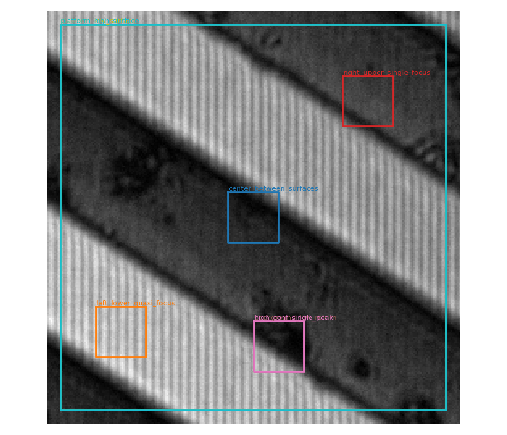

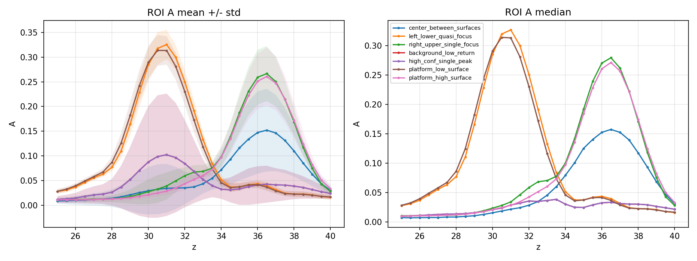

### 4.2 T6/T12 响应与频域对比

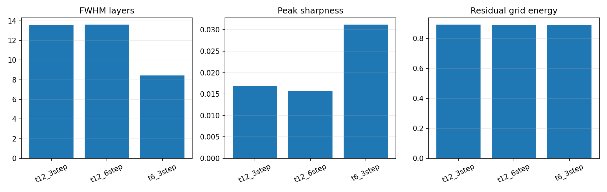

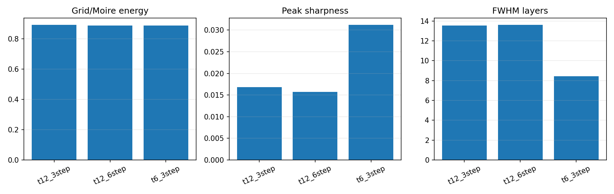

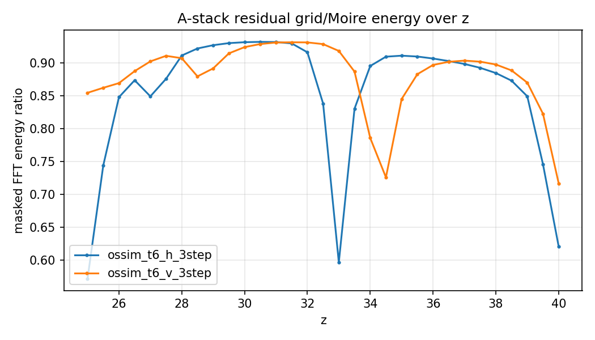

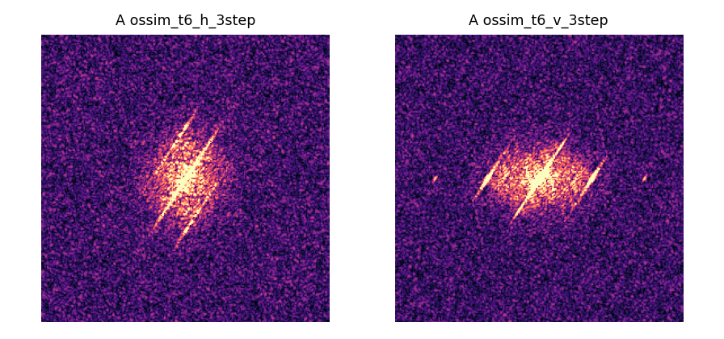

### 4.3 Forward、LS、latent/filter 对照

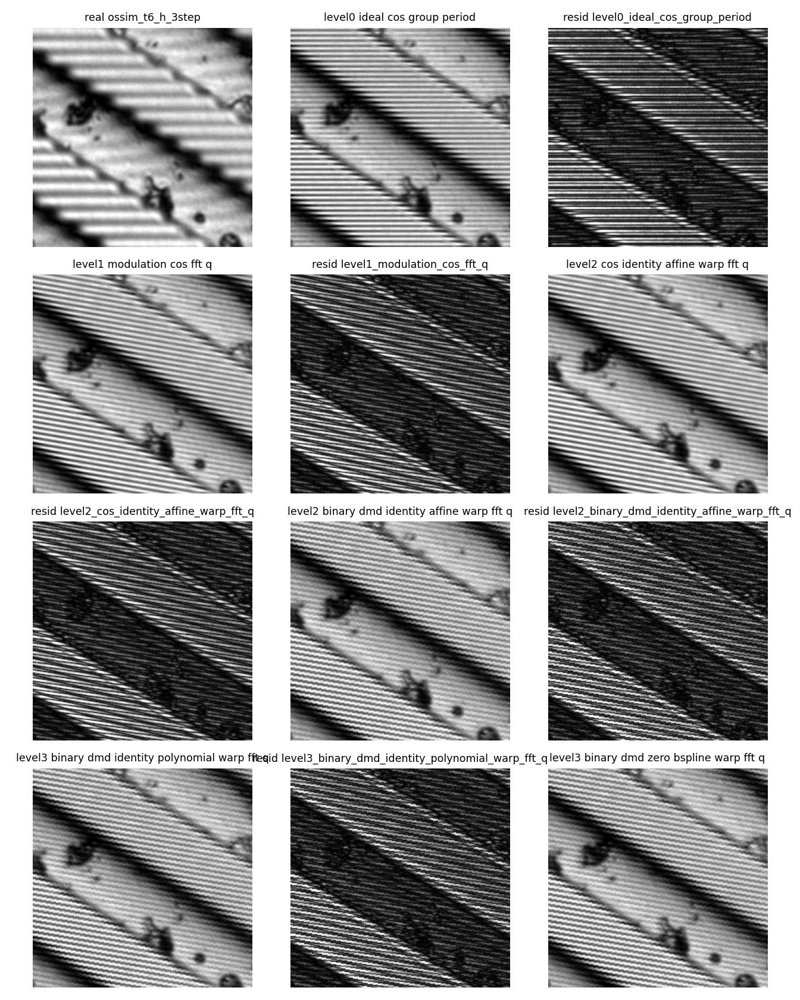

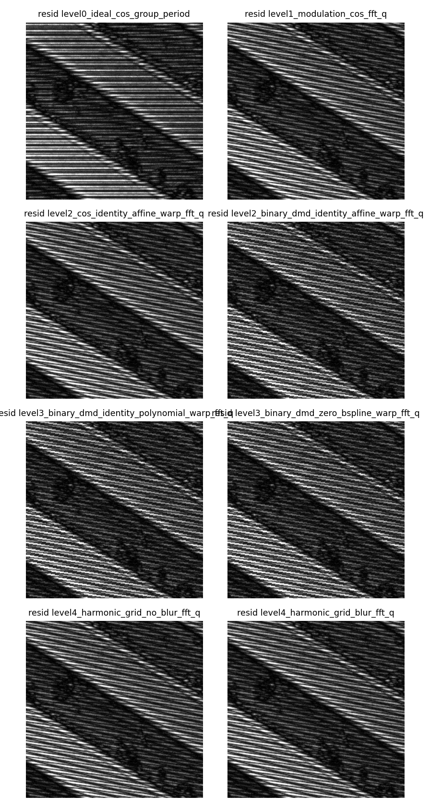

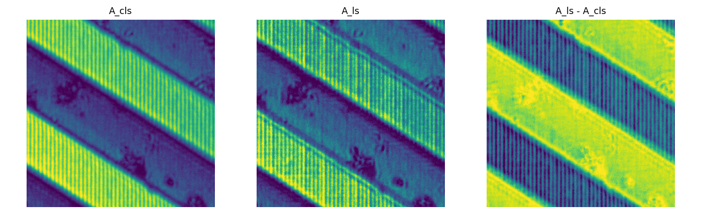

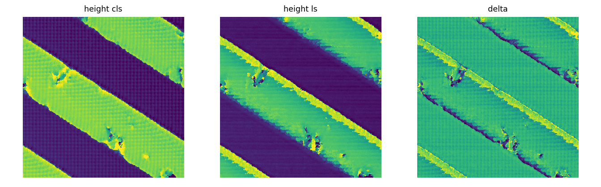

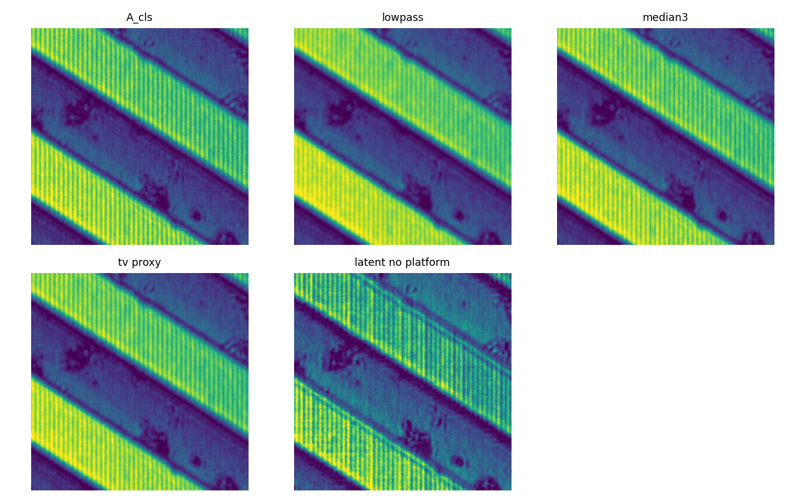

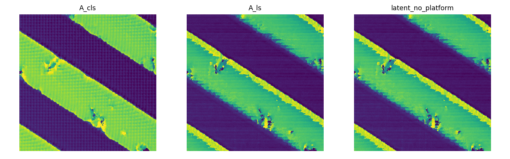

## 5. 结果对比

### 5.1 轴向连续调制度响应

全局指标：

| 指标 | 数值 |
|---|---:|
| mean FWHM | `8.4516` layers |
| mean peak sharpness | `0.03123` |
| mean peak/background | `3.0563` |
| invalid fraction | `0.0` |
| T6/T12 winner | `t6_3step` |

ROI 指标：

| ROI | peak z | FWHM | peaks | entropy | confidence |
|---|---:|---:|---:|---:|---:|
| center_between_surfaces | `36.5` | `4.5` | `1` | `0.3713` | `0.0521` |
| left_lower_quasi_focus | `31.0` | `3.5` | `1` | `0.3162` | `0.0529` |
| right_upper_single_focus | `36.5` | `3.5` | `1` | `0.3324` | `0.0572` |
| background_low_return | `31.0` | `3.5` | `2` | `0.3220` | `0.0547` |
| platform_low_surface | `30.5` | `4.0` | `1` | `0.3252` | `0.0010` |
| platform_high_surface | `36.5` | `3.5` | `1` | `0.3369` | `0.0751` |

解释：

- 多数 ROI 不是 delta-like 单层响应，而是有 3.5-4.5 z-unit 宽度的连续峰。
- 背景/低回光区域出现 2 个峰，提示低信噪比或残余结构会污染简单寻峰。
- 平台低表面 confidence 很低，说明即使有单峰，也不应把所有区域等同为可靠高度。

### 5.2 T6/T12 对比

| 组别 | grid energy mean | peak sharpness mean | FWHM layers mean | height std |
|---|---:|---:|---:|---:|
| T12 3-step | `0.8931` | `0.01683` | `13.5448` | `3.0850` |
| T12 6-step | `0.8882` | `0.01571` | `13.6184` | `3.1248` |
| T6 3-step | `0.8885` | `0.03123` | `8.4516` | `2.9363` |

诊断结论：

- T6 3-step 的 FWHM 明显更窄，peak sharpness 接近 T12 的两倍。
- T12 6-step 的 grid energy 略低于 T6，但峰更宽、sharpness 更低。
- 综合 grid/sharpness/FWHM 后，本轮诊断选择 `T6 3-step`。

### 5.3 Forward model 对比

| 方向 | 最优/代表模型 | mod RMSE | residual grid | stripe leakage |
|---|---|---:|---:|---:|
| H | measured calibrated + blur | `0.06283` | `0.12208` | `0.01344` |
| H | ideal cos baseline | `0.14683` | `0.68311` | `0.02073` |
| V | binary DMD identity affine warp | `0.14047` | `0.03841` | `0.53229` |

解释：

- H 方向中，实测 DMD 图案和 DMD-CCD 标定显著降低调制域 RMSE。
- V 方向 measured calibrated row 没有在 RMSE 上胜过 generated binary control，说明 V 方向仍存在映射、相位或方向相关退化未解释。
- residual FFT 中仍有结构性峰，forward model 还没有完全解释真实调制域残差。

### 5.4 固定 `M_theta` LS projection

| 方法 | modulation loss | grid energy | height std |
|---|---:|---:|---:|
| `A_cls` | `0.06152` | `0.86824` | `2.93635` |
| `A_ls_fixed_Mtheta` | `0.03354` | `0.76991` | `3.06327` |

解释：

- 固定 measured-calibrated `M_theta` 后，闭式 LS 已显著降低调制域 loss。
- grid energy 也下降，说明一部分 residual 来自 pattern mismatch，而不需要网络即可改善。
- 但 height std 变大，说明“更好重投影”不等于“更好高度计量”。

### 5.5 latent / filter / network 对比

| 方法 | fused grid energy | A TV | height std | invalid fraction |
|---|---:|---:|---:|---:|
| `A_cls` | `0.88851` | `0.01564` | `2.93635` | `0.0` |
| `A_cls_lowpass_sigma1` | `0.90495` | `0.00759` | `2.91731` | `0.0` |
| `A_cls_median3` | `0.90072` | `0.00883` | `2.92773` | `0.0` |
| `A_cls_tv_proxy_smooth` | `0.89905` | `0.01051` | `2.92720` | `0.0` |
| `latent_no_platform` | `0.83858` | `0.00995` | `3.05567` | `0.0` |
| `A_ls_fixed_Mtheta` | `0.83703` | `0.01023` | `3.06327` | `0.0` |
| `existing_network` | `0.84112` | `0.00047` | `2.84224` | `0.0` |

解释：

- `latent_no_platform` 和 `A_ls_fixed_Mtheta` 的 grid energy 接近，并都低于 `A_cls`。
- 简单 lowpass/median 降低 A TV 和 height std，但没有降低 grid energy，不能作为物理解释。
- existing network 的 A TV 极低，提示明显平滑化；虽然 height std 较低，但不能排除 platform loss / select-best / weak supervision 导致的形态过平滑。
- 当前证据支持“先把 LS projection 和受限 forward model 作为主线”，网络只能作为后续对照。

### 5.6 metrology 诊断

| 方法 | height mean | height std |
|---|---:|---:|
| `A_cls` | `33.6840` | `2.93635` |
| `A_ls` | `33.1294` | `3.06327` |
| `latent_no_platform` | `33.1263` | `3.05567` |

Repeatability/internal consistency：

| 指标 | 数值 |
|---|---:|
| method_count | `3` |
| pixelwise std mean | `0.39325` |
| pixelwise std p95 | `1.42111` |
| method mean range | `0.55771` |
| absolute metrology claim | `False` |

解释：

- 没有提供 nominal step 或独立标准件高度，因此不报告绝对误差。
- 当前只能说不同方法之间的 internal consistency，而不能说绝对计量精度提高。

## 6. 科学判断

### 可以写进论文或阶段报告的结论

- 真实反射式 DMD-OS-SIM 数据支持“条纹调制度随轴向离焦连续变化”的解释框架。
- `A_k` 可以被解释为“当前轴向层仍能承载多少投影条纹”的有效调制度，而不是 clean ground truth。
- T6 3-step 在当前数据和诊断指标下比 T12 3-step / T12 6-step 更适合作为主线输入。
- 受限 `M_theta` 的质量非常关键；H 方向 measured calibrated pattern 明显优于 ideal cos。
- 固定 `M_theta` 的 LS projection 是强 baseline，必须放在网络之前。

### 暂时不能写成强结论的内容

- 不能说网络已经证明比 LS projection 或简单滤波更必要。
- 不能说 platform RMS 或 height std 降低等于绝对精度提高。
- 不能说已经恢复完整像差、BRDF、多重反射或完整 3D PSF。
- 不能把 `A_cls` 当 clean ground truth。
- 不能把仿真或同 crop select-best 的结果当真实泛化证据。

## 7. 下一步建议

1. 对 V 方向做受限 phase/warp/blur 诊断，因为 V 方向 forward RMSE 仍未被 measured calibrated pattern 解释好。
2. 将 `A_ls_fixed_Mtheta` 作为主 baseline，与后续 latent/network 统一比较。
3. 增加 held-out crop 或跨样本验证，避免同一 crop 上选 epoch。
4. 如果有标准台阶或重复扫描，运行 `scripts/evaluate_metrology.py` 并提供 nominal step，才报告绝对误差。
5. 网络训练默认禁用 platform loss；platform loss 只能作为 control，不作为主科学证据。

## 8. Mac 上如何查看

推荐方式是 GitHub：

1. 打开当前 PR。
2. 进入本文件：`docs/os_sim_v1_continuous_modulation_report.md`。
3. GitHub 会直接渲染 Markdown、公式和图片。

如果要在 Mac 本地查看：

```bash
git clone https://github.com/zijin556/OS-SIM.git
cd OS-SIM
git fetch origin codex/os-sim-v1-continuous-modulation
git switch codex/os-sim-v1-continuous-modulation
open docs/os_sim_v1_continuous_modulation_report.md
```

注意：完整 `.npy`、大图和实验输出仍按 `.gitignore` 保留在 Windows 本地 `outputs/`，没有上传到 GitHub。本报告只上传了精选小图和关键数值，适合在 Mac 上快速审阅科学结论。
