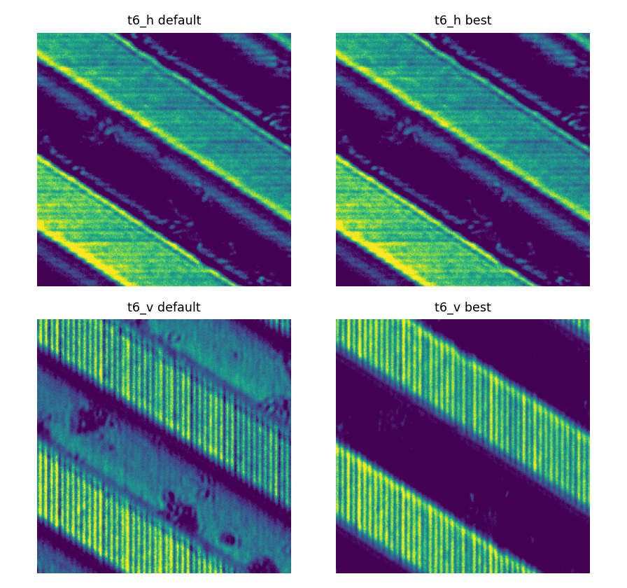
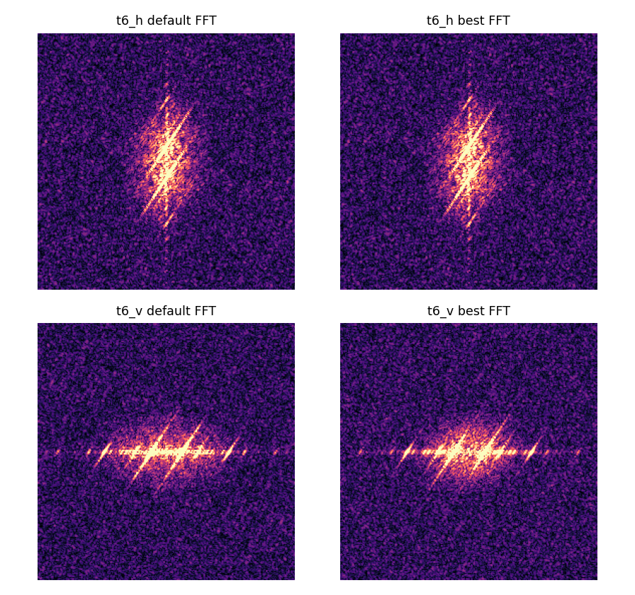
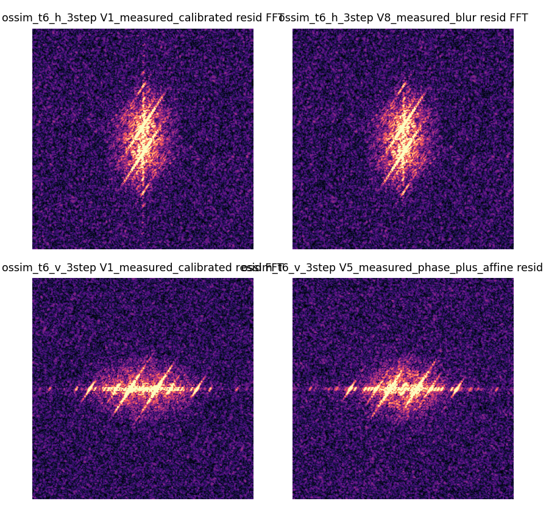
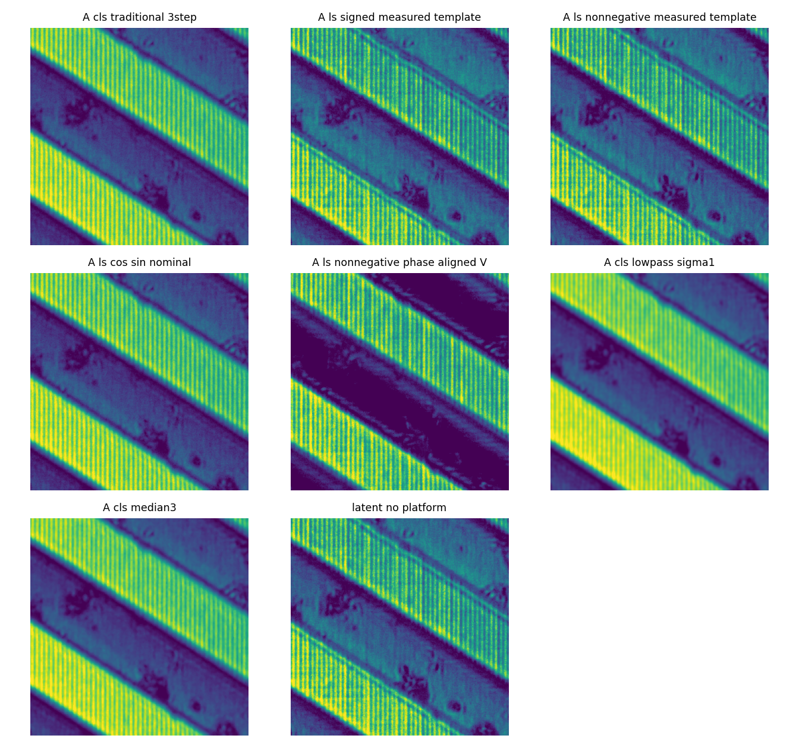
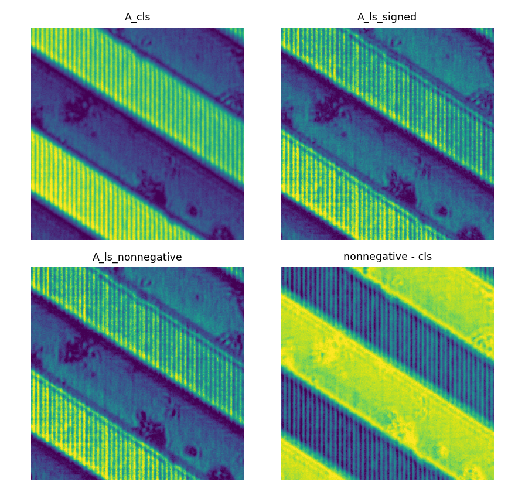
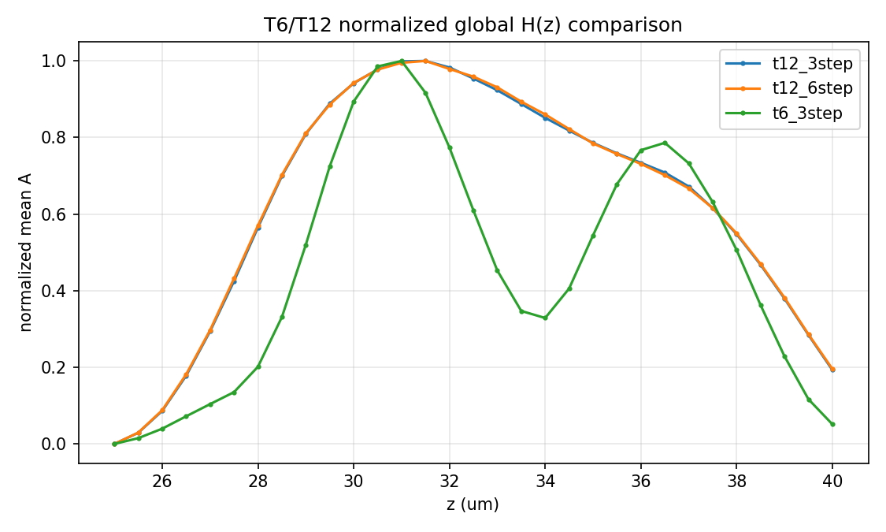
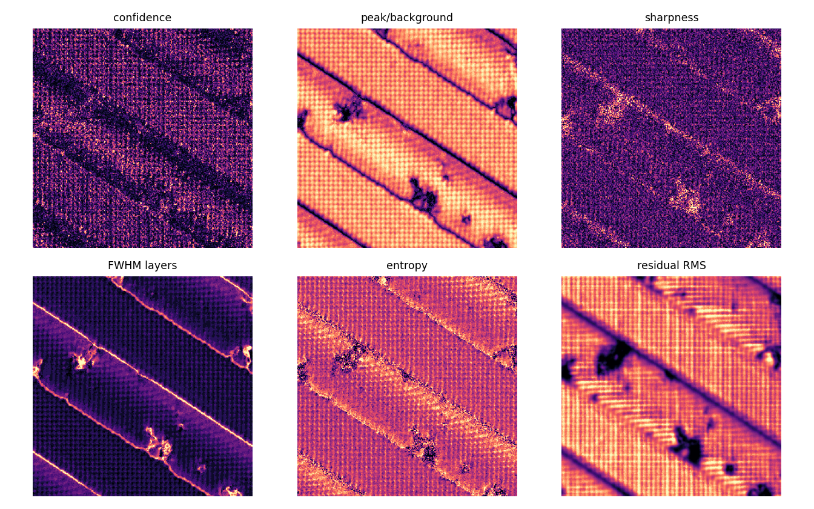
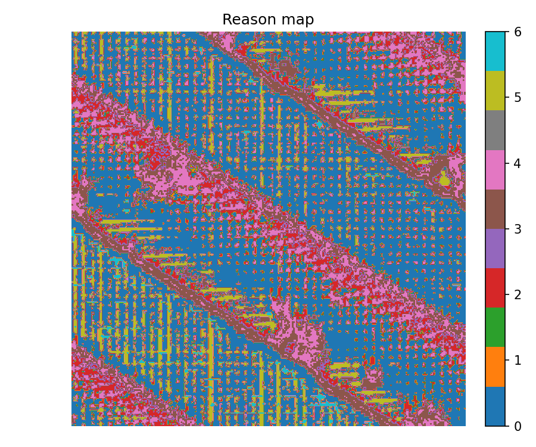
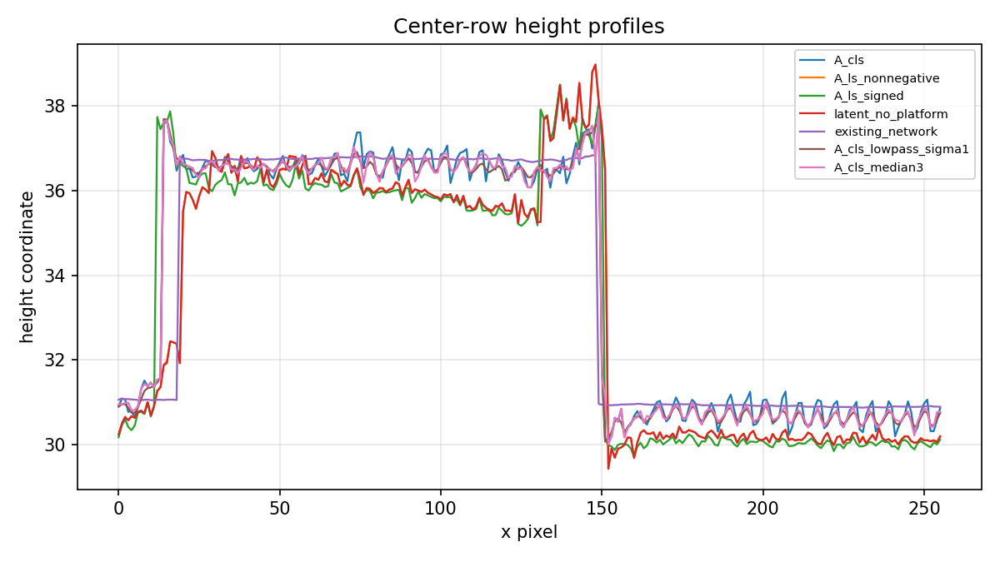

# OS-SIM v1_next 研究报告

本轮目标不是继续训练网络，而是验证三件事：`M_theta` 是否可信、固定 `M_theta` 的闭式 `A_ls` 能做到什么程度、哪些结果可以作为论文结论。默认数据为 `细台阶`，crop 为 `center:256`。

## 一句话结论

当前最重要的发现是：T6-V 的相位顺序/相位零点不是默认顺序。修正 V 相位后，固定 measured-calibrated `M_theta` 的 nonnegative LS projection 把 modulation loss 从传统 `A_cls` 的 `0.06152` 降到 `0.02719`。因此下一步主线应是 phase-aligned `A_ls`，不是继续训练网络。

## 哪个是原始，哪个更好

| 方法 | 含义 | 调制 loss | fused grid | height std | H/V 高度差 |
|---|---|---:|---:|---:|---:|
| `A_cls_traditional_3step` | 原始三步 OS-SIM 解调 baseline | 0.06152 | 0.88851 | 2.93635 | 0.97205 |
| `A_ls_nonnegative_measured_template` | 默认 measured `M_theta` 闭式 LS | 0.03354 | 0.62218 | 3.06324 | 2.76922 |
| `A_ls_nonnegative_phase_aligned_V` | V 相位修正后的闭式 LS | **0.02719** | 0.83281 | 2.90407 | **0.73479** |
| `latent_no_platform` | 旧 latent 优化，无 platform loss | 0.03357 | 0.62320 | 3.05567 | 2.70951 |
| `existing_network_fused_only` | 已保存网络输出，只能作 fused 参考 | n/a | 0.84112 | **2.84224** | n/a |

`A_cls` 是原始算法结果，不是真值。`existing_network` 的 height std 最低，但 TV 极低，且没有 H/V phase-domain residual 可比，暂时只能说“更平滑”，不能说“更准”。

## Phase Order

T6-H 默认 `[0,1,2]` 就是最佳。T6-V 最佳 raw permutation 是 `[2,0,1]`，等价于 measured template permutation `[1,2,0]`。默认 V 排第 4/18，不是最佳。

## Forward Model

H 方向 measured pattern 基本可用，最佳是 measured + blur，loss `0.02186`。V 方向最佳是 measured + phase offset + affine shift，loss `0.02768`，参数为 `perm=[1,2,0], dy=1, dx=1`。所以 V 的主要问题是相位对齐，其次才是小映射偏移/blur/图案细节。

## Unified Metrics

旧报告里的 grid energy 不能直接混比，因为有 `A-grid`、`fused-grid`、`residual-grid`、`stripe leakage` 多种定义。本轮已用 `src/metrics_v1.py` 统一重算。

关键解释：

- `A_ls_nonnegative_measured_template` 让 fused A-grid 从 `0.88851` 降到 `0.62218`，但 H/V consistency 变差。
- `A_ls_nonnegative_phase_aligned_V` 让 modulation loss 最低，并改善 H/V consistency。
- residual-grid/stripe leakage 仍然存在，说明 forward model 尚未完全解释结构条纹。

## LS Baseline

Signed LS 的负幅值比例为 `38.19%`，H 为 `34.24%`，V 为 `42.14%`。这说明 signed LS 虽然 loss 低，但很多区域的幅值符号不物理，不能直接作为最终调制度。

结论：当前正式 baseline 应该是 `A_ls_nonnegative_phase_aligned_V`，不是 signed LS，也不是网络。

## Axial Response

z step 来自 config：`0.5 um`。T6/T12 FWHM：

| pair | mean FWHM | peak sharpness | peak/background |
|---|---:|---:|---:|
| T6 3-step | **4.226 um** | **0.03123** | **3.0563** |
| T12 3-step | 6.772 um | 0.01683 | 2.1449 |
| T12 6-step | 6.809 um | 0.01571 | 2.1439 |

T6 更窄、更尖，支持“更高条纹频率带来更强光切片/轴向调制度选择性”的经验解释。NA、wavelength 未提供，所以还不能声称与 Stokseth 理论数量级严格对上。

## Confidence Mask

新的 invalid fraction 是 `47.57%`，不再是 0。有效单峰为 `52.43%`。主要无效原因：

| reason | fraction |
|---|---:|
| broad peak | 10.68% |
| double peak | 12.23% |
| H/V inconsistent | 13.14% |
| high residual | 9.70% |
| saturated/invalid raw | 1.66% |

## Metrology

没有发现 nominal step height 或独立标准件真值，所以不能报告 absolute error。只能报告内部一致性、confidence-masked height std、方法间差异。

confidence mask 后的 height std：

| 方法 | 全图 height std | masked height std |
|---|---:|---:|
| `A_cls` | 2.93635 | 2.84982 |
| `A_ls_nonnegative` | 3.06324 | 2.87374 |
| `A_ls_signed` | 3.10816 | 2.88756 |
| `latent_no_platform` | 3.05567 | 2.87237 |
| `existing_network` | **2.84224** | **2.78542** |
| `A_cls_lowpass_sigma1` | 2.91731 | 2.83205 |
| `A_cls_median3` | 2.92773 | 2.83903 |

网络更平，但还不能说更准。`A_ls` 改善的是 modulation-domain fit，不是已证明的绝对计量精度。

## 可以写进论文的结论

1. 真实数据支持连续轴向调制度响应，而不是简单二值 on/off。
2. T6 在该 crop 上比 T12 具有更窄 FWHM 和更高 peak sharpness。
3. 固定 measured-calibrated `M_theta` 的 LS projection 是强 baseline，能显著降低 modulation residual。
4. V 方向需要相位对齐；默认帧序不能直接作为 0/120/240 的物理事实。
5. confidence/invalid mask 有实际区分度，可用于剔除宽峰、双峰、H/V 不一致和高 residual 区域。

## 现在不能写的结论

1. 不能声称绝对高度精度提升。
2. 不能声称网络优于 `A_ls`。
3. 不能把更低 height std 解释成真实计量更准。
4. 不能声称已与 Stokseth 理论定量吻合，因为缺 NA/wavelength/illumination frequency。
5. 不能声称 forward model 已完全解释 residual FFT；结构残差仍存在。

## 下一阶段关键实验

1. 在 held-out crop 和其他完整样本上重跑 phase-aligned `A_ls`。
2. 对 V 的 phase offset/affine shift 做独立校准，而不是在同一 crop 上选最优。
3. 如果有标准件或重复扫描，运行真正 metrology/repeatability 验证。
4. 只有当 `A_ls` 和简单滤波在 held-out 验证上不够用，且网络确实降低 modulation residual 与 residual FFT，同时不过度平滑，才恢复网络训练。

完整本地输出见 `outputs/v1_next/v1_next_report.md` 及各 task 子目录。
